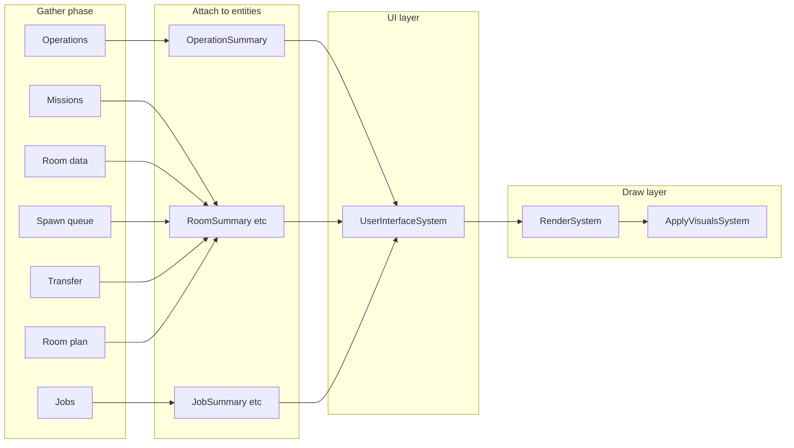

# AI state visualization overhaul

## Current state

- **Scattered drawing**: Operations, missions, and jobs call `describe()` during their run and push directly to `UISystem` + `Visualizer` (e.g. [operations/colony.rs](c:\code\screeps-ibex\screeps-ibex\src\operations\colony.rs), [missionsystem.rs](c:\code\screeps-ibex\screeps-ibex\src\missions\missionsystem.rs) line 157, each job’s `describe()`). Room data is drawn in [updateroomsystem.rs](c:\code\screeps-ibex\screeps-ibex\src\room\updateroomsystem.rs); construction in [roomplansystem.rs](c:\code\screeps-ibex\screeps-ibex\src\room\roomplansystem.rs); spawn queue in [spawnsystem.rs](c:\code\screeps-ibex\screeps-ibex\src\spawnsystem.rs); transfer/order in transfersystem and ordersystem.
- **Display order** depends on execution order; layout uses fixed positions ([ui.rs](c:\code\screeps-ibex\screeps-ibex\src\ui.rs) OPERATIONS_POS, MISSION_POS, etc.).
- **Feature naming**: Top-level is `features.visualize.on`; [PathingFeatures](c:\code\screeps-ibex\screeps-ibex\src\features.rs) and [RoomFeatures](c:\code\screeps-ibex\screeps-ibex\src\features.rs) use `visualize_on` and a helper `visualize(global_visualize)`.
- **Defaults**: [VisualizeFeatures](c:\code\screeps-ibex\screeps-ibex\src\features.rs) already defaults `on: true`. Pathing defaults `visualize_on: false`, Room `visualize_on: true`.
- **Missing**: Order queue visualization is stubbed ([ordersystem.rs](c:\code\screeps-ibex\screeps-ibex\src\transfer\ordersystem.rs) line 82–91).

## Naming (avoid VisualizationSystem vs VisualizerSystem)

- **VisualizerSystem** (existing in [visualize.rs](c:\code\screeps-ibex\screeps-ibex\src\visualize.rs)) is the system that **flushes** the `Visualizer` resource to the game (e.g. `console::add_visual`). Rename it to **ApplyVisualsSystem** (or **FlushVisualsSystem**) so it is clearly “apply visuals to the game,” not “do visualization.”
- The system(s) that turn summary data into something drawn are named so they don’t sound like the flusher:
  - **Single-layer**: one system turns summary → raw draw primitives (text, circle, line, poly). Call it **RenderSystem** — it “renders” summary data into draw commands written to `Visualizer`.
  - **Two-layer (recommended)**: **UserInterfaceSystem** turns summary data into **high-level UI primitives** (list, chart, graph, panel) — structure only, no theme. **RenderSystem** then turns those primitives + **theme** into raw draw primitives and writes to `Visualizer`. So: summary → UI primitives → draw primitives (with theme). Both layers are useful: UI layer centralizes layout/structure; Render layer centralizes look-and-feel and makes theming easy.

## Architecture: typed data attached to entities; UI and render layers

- **Data types, not raw strings**: Use typed visualization data structs (e.g. `OperationSummary`, `MissionSummary`, `JobSummary`, `RoomVisibilitySummary`, `SpawnQueueEntry`, transfer/order summaries). These are **attached to entities** (rooms, creeps, or a dedicated "global" slot) so that "what to show" is associated with the right object.
- **Only the UI/render pipeline produces draw commands**: Gather systems **only** produce/attach summary data. **UserInterfaceSystem** (if used) turns summary into high-level primitives. **RenderSystem** turns (summary or high-level primitives) into raw draw primitives and writes to `Visualizer`. **ApplyVisualsSystem** (renamed from VisualizerSystem) flushes `Visualizer` to the game.
- **Not serialized**: Visualization data is tick-local and never written to Memory/segments; it may still be attached to entities (e.g. as components or via a resource keyed by entity/room).

1. **Visualization data types (entity-attached)**
  - Define **typed structs** for each kind of display: e.g. `OperationSummary`, `MissionSummary`, `JobSummary`, `RoomVisibilitySummary`, `SpawnQueueEntry`, transfer/order items, construction planner/plan data. These hold only data (no rendering).
  - **Attach to entities**: Use (a) **components** on entities (e.g. visualization data on room entities, or a collection component), and/or (b) a **resource** mapping entity/room to lists of visualization items (e.g. `HashMap<RoomName, Vec<RoomVisualizationItem>>` plus a global list for operations). Attaching to rooms/creeps keeps "which room this belongs to" explicit.
  - Not serialized; cleared or recreated each tick before gather systems run.
2. **Gather systems**
  - **Only read** from ECS and resources (SpawnQueue, OrderQueue, etc.); **only write** by attaching or pushing these **typed data objects** (no rendering). No access to `Visualizer` or `UISystem`.  
  - Suggested split: gather operations (or combined “GatherAIStateVisualization”): iterate operations → describe to strings; missions → describe to strings; jobs (per room) → describe to strings; spawn queue (per room) → lines; room data (visibility lines) from `RoomData`.  
    - **GatherTransferVisualization**: transfer queue / demand and (when implemented) order queue.  
    - **GatherConstructionVisualization** (or keep RoomPlanSystem but have it write to VisualizationState instead of Visualizer): planner state and plan overlay.
  - Pathing can stay as-is (movement system draws paths) or emit a path summary data type that the visualization system turns into lines.
3. **UserInterfaceSystem (optional two-layer)** and **RenderSystem** and **UserInterfaceSystem**: Reads summary data (and feature flags); produces **high-level UI primitives** (e.g. list, chart, graph, panel) — positions and structure, no theme. Output is a buffer of these primitives (or a resource) consumed by RenderSystem. Omit this layer if we keep a single render step.
  - **RenderSystem**: Reads (summary data directly, or high-level primitives from UserInterfaceSystem) and **theme**; produces **raw draw primitives** (text, circle, line, poly) and writes to `Visualizer`. All look-and-feel and theme application lives here.
  - **ApplyVisualsSystem** (rename of current VisualizerSystem): Reads `Visualizer` and flushes it to the game (e.g. `console::add_visual`). No name overlap with "visualization" or "render."
  - (Single-layer alternative: one **RenderSystem** does summary → draw primitives; no UserInterfaceSystem.)
  - Runs **after** all gather systems (and after UserInterfaceSystem if present), **before** ApplyVisualsSystem. Pipeline: gather → attach data → UserInterfaceSystem (if used) and RenderSystem turn data into Visualizer calls → ApplyVisualsSystem flushes to game.
4. **Remove inline drawing from logic**
  - Operations/missions/jobs: `describe()` only produces (or fills) the typed DTOs that gather systems attach; no visualizer/ui.
  - SpawnQueueSystem, UpdateRoomDataSystem, RoomPlanSystem, transfer/order: stop taking `Visualizer`/`UISystem`; gather system(s) read the same ECS/resource data and attach the corresponding visualization data types.
5. **Dispatcher order**
  - In [game_loop.rs](c:\code\screeps-ibex\screeps-ibex\src\game_loop.rs): ... RoomPlanSystem → gather system(s) → **UserInterfaceSystem** (if used) → **RenderSystem** → **ApplyVisualsSystem** → StatsSystem ...

## When visualization is off (efficiency, specs-safe)

- When `features.visualize.on` is **false**: do **not** insert the visualization data resource (same pattern as today for `Visualizer` and `UISystem` in [game_loop.rs](c:\code\screeps-ibex\screeps-ibex\src\game_loop.rs): insert when on, remove when off).
- **Gather systems**, **UserInterfaceSystem** (if used), and **RenderSystem** must request the visualization data resource (and any UI-primitive buffer) as **optional** in their `SystemData` (e.g. `Option<Write<'a, VisualizationData>>` or `Option<Read<'a, VisualizationData>>`). In their `run()`, if the option is `None`, return immediately without doing work. No allocation, no iteration over operations/missions/jobs for display.
- **Specs-safe**: Using `Option<...>` for the resource ensures that when the resource is not in the world (visualization off), the systems still run but get `None` and no-op. No `WriteExpect`/`ReadExpect` that would panic on a missing resource. The dispatcher order is unchanged; only the presence of the resource changes.
- **ApplyVisualsSystem** (renamed from VisualizerSystem) already runs only when `Visualizer` is present (it uses `Option<Write<'a, Visualizer>>`); keep the same pattern for the new visualization data resource so that when visualization is off, no summary data is generated and no render work is done.

## Summary vs historical data

- **Summary is per-tick only**: Visualization summary data is generated each tick and is not persisted. Summary types (e.g. `OperationSummary`, market summary) should **not** store long-lived historical data (e.g. raw market price history across many ticks).
- **Historical data is each system’s responsibility**: If a system wants to show historical data (e.g. market price over time), it must store that history itself (e.g. in Memory, a resource that is updated over time, or segments). The summary types are not the place for that storage.
- **Summary may include historical-derived data for rendering**: When building the summary each tick, a system may read its own stored history and push **derived** values into the summary (e.g. "last N prices", or a precomputed sparkline). The summary is still regenerated each tick; it may contain fields that were computed from history for display only.

## Feature flag naming

- Use `**visualize**` (with nested `.on`) everywhere, not `visualize_on`.  
- **PathingFeatures**: replace `visualize_on: bool` with e.g. `visualize: PathingVisualizeFeatures { on: bool }` (or a single-field struct) so the API is `features.pathing.visualize.on`. Keep a helper like `enabled(global)` if call sites need “global and pathing”.  
- **RoomFeatures**: same — `visualize: RoomVisualizeFeatures { on: bool }` instead of `visualize_on`.  
- **Defaults**: Keep top-level `visualize.on == true`. After renaming, set pathing/room `visualize.on` defaults as desired (e.g. pathing off, room on) and ensure visualization is enabled by default in the sense that the main switch stays on.

## Enable visualization by default

- Top-level `VisualizeFeatures::default()` already has `on: true` in [features.rs](c:\code\screeps-ibex\screeps-ibex\src\features.rs).  
- Ensure no other default flips it off; after renaming, sub-features (pathing, room, construction, transfer) should use `.on` under `.visualize` and default so that “visualization on” is the default experience.

## Optional improvements (layout / “less ugly”)

- **Layout**: Keep or refine the fixed positions in one place (e.g. in the render system or a small layout module) so all text/lists are consistent and readable.  
- **Order queue**: When implementing the order queue visualization (currently TODO in ordersystem), have the gather system attach order summary data types (e.g. to the room or a resource); the visualization system turns them into drawing commands.  
- **Room plan / foreman**: Continue using the existing `RoomVisualizer` trait (screeps-foreman) from **RenderSystem**: gather system attaches planner/plan data (or references) to the room or a resource; RenderSystem gets `Visualizer` and calls foreman’s `visualize()` into the appropriate `RoomVisualizer`.

## Files to touch (summary)

- **New**: Typed visualization data types (entity-attached or resource), gather system(s), optional **UserInterfaceSystem** (summary → high-level UI primitives), **RenderSystem** (primitives + theme → draw commands into `Visualizer`), and rename current VisualizerSystem to **ApplyVisualsSystem** (e.g. under `screeps-ibex/src/` in a module like `visualization` or `visualize.rs`).
- **game_loop.rs**: Register visualization data resource (or components); add gather system(s), optional UserInterfaceSystem, and **RenderSystem** before **ApplyVisualsSystem**; only insert the visualization data resource and `Visualizer` when `features.visualize.on` (same insert/remove pattern so gather/UI/render systems no-op when off).
- **features.rs**: Replace `visualize_on` with `visualize: XxxVisualizeFeatures { on }` for Pathing and Room; adjust defaults and call sites.
- **Operations / missions / jobs**: Change `describe()` to not take or use visualizer/ui; return or store **typed DTOs** that gather systems attach to entities or a resource.
- **spawnsystem.rs, updateroomsystem.rs, roomplansystem.rs, transfer/ordersystem.rs, transfersystem.rs**: Remove direct use of Visualizer/UISystem for drawing; gather system(s) will read from the same ECS/resource data and attach typed visualization data to entities/resource.
- **pathing movementsystem**: Update to use `features.pathing.visualize.on` (and global) after feature rename.

## Serialization / persistence

- Visualization data (typed structs attached to entities or in a resource) is **not** serialized: it is recreated every tick and only used for drawing. No changes to segment format or `serialize.rs`.

