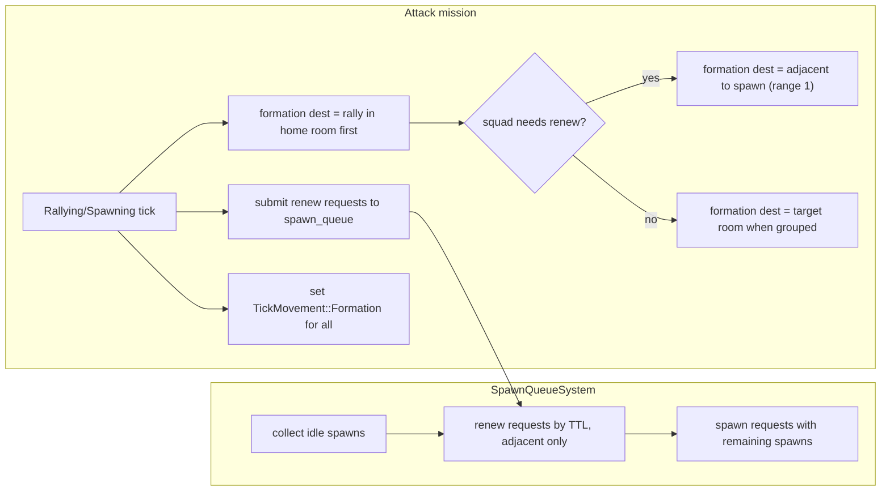

# Squad renew and group-up during spawning and pre-engage

## Current behavior (to change)

- **Spawning state** ([attack_mission.rs](c:\code\screeps-ibex\screeps-ibex\src\missions\attack_mission.rs)): Sets formation orders for all members, advances virtual position toward target room, then calls `renew_squad_members()` which **overrides** orders per low-TTL creep with `MoveTo(spawn)` / `Hold` and `renewing: true`, so individuals leave the formation to go to spawns.
- **Rallying state**: Only formation movement toward target room; no renewal at all.
- **renewal.rs** ([renewal.rs](c:\code\screeps-ibex\screeps-ibex\src\military\renewal.rs)): `renew_squad_members` picks nearest idle spawn per member, sets movement to that spawn or calls `renew_creep` when adjacent. Idle spawns are those with `spawn.spawning().is_none()`; there is no coordination with the spawn queue, so a spawn can be used for renew and then the same tick get a new creep spawn request.
- **Spawn system** ([spawnsystem.rs](c:\code\screeps-ibex\screeps-ibex\src\spawnsystem.rs)): Processes only spawn requests; runs **after** missions, so missions can push requests and they are consumed later in the same tick.

## Target behavior

1. **Squad never drives renew movement**
  Squad behavior (and renewal.rs) must not set `TickMovement::MoveTo(spawn)` or `renewing: true` for individuals. Everyone stays on formation orders.
2. **Formation always groups up first, then moves to engagement**
  The formation target must **first bring the squad together** (e.g. rally in the home room or at a single group-up position) before the squad moves as a group to the engagement room. This avoids individuals being picked off early or trickling into the target room alone. So: spawn → **rally/group in home room** (renew if needed while there) → **then** advance together toward target room. The virtual position / formation destination should not send each creep straight toward the target room from wherever they spawned; there is an explicit “group up” phase.
3. **Formation destination is group-level; rally = nearest home room to engagement**
  During Spawning and Rallying, the mission chooses a single formation destination:
  - **Group-up**: The formation location before engagement is the **nearest spawn/home room (with energy) to the intended engagement target**. Rally position is in that room (e.g. room center or spawn-adjacent tile). This avoids extraneous movement and gives faster response when the squad actually moves to engage.
  - **Renew**: If the squad needs renew and is in (or will be in) a home room with an idle spawn, formation target can be set to a position that puts the formation **adjacent to that spawn** (see spawn distance below); the group moves there together, then renew requests are fulfilled for creeps that end up adjacent.
  - **Engagement**: Only once the squad is grouped (and optionally renewed), formation target becomes the target room so the squad moves into the engagement room together.
4. **Renew requires adjacency (spawn distance)**
  The game API only allows `renew_creep` when the creep is **adjacent** (range 1) to the spawn. So:
  - The “position near spawn” used as formation destination must be chosen so that **at least one formation slot is on a tile adjacent to the spawn** (e.g. formation anchor = spawn position if walkable, or an adjacent walkable tile so one formation offset is range 1 from the spawn). Spawn distance is critical: if the formation only gets within range 2, no renew can occur.
  - The spawn system only fulfills renew requests when the creep’s current position is adjacent to an idle spawn.
5. **Renew as requests, fulfilled by spawn system**
  Mission (and optionally other callers) submit **renew requests** per creep that needs renew (entity + TTL for priority). The spawn system processes renew requests **before** spawn requests per room, using only spawns that are idle. Renew is only performed when the creep is **already adjacent** to an idle spawn (formation brings the group to the spawn; we don’t move individuals to spawn).
6. **Spawn eligibility for renew**
  A spawn can be used for renew only if it is not currently spawning and will not be chosen to start a new creep this tick. So when processing a room, the spawn system will: (1) collect idle spawns; (2) process renew requests (sorted by TTL ascending), fulfilling only for creeps adjacent to an idle spawn and marking that spawn as used; (3) process spawn requests with remaining idle spawns. Thus renew effectively has priority over spawn when a creep is about to die and is already at a spawn.
7. **Renew vs spawn priority: dynamic TTL threshold from spawn duration**
  The spawn queue system should compute a **final TTL threshold** for when to prefer renew over starting the next spawn. Spawn duration is computable from the next spawn request’s body parts (ticks to complete). If starting a new spawn would take N ticks and a creep would die (TTL < N) before that spawn finishes, it is likely optimal to renew that creep first. So: for each room, consider the next spawn request’s body cost → spawn time in ticks; use that (or a small buffer) as the threshold: only fulfill renew requests for creeps with TTL below that threshold before consuming the spawn for the new creep. Among renew requests, lower TTL = higher priority. Renew phase runs first; spawn phase uses remaining spawns.
8. **Transit renewal (Rallying)**
  When the formation is in transit and passes through a home room (or is still in one), if any member needs renew the mission sets formation target to “near an idle spawn” in that room so the squad groups there; renew requests are submitted for low-TTL members and fulfilled when adjacent. When not in a home room, no renew (no spawns); formation continues toward target room.
9. **Cohesion**
  No creep is ever given an order to leave the formation to renew; the only movement is formation movement. Renew is a group-level decision (formation target) plus request/submit; execution is “when adjacent, spawn system renews.”
10. **Renew requests ephemeral; defense uses same path**
  Renew requests are ephemeral (cleared each tick when the queue is processed), like spawn requests. The defense mission uses the same spawn-system renew path (submit renew requests; SpawnQueueSystem fulfills when adjacent) instead of a separate opportunistic helper.

---

## Implementation plan

### 1. Renew requests in the spawn system

- **Add a renew-request type and storage (ephemeral)**  
  - In [spawnsystem.rs](c:\code\screeps-ibex\screeps-ibex\src\spawnsystem.rs): define `RenewRequest { creep_entity: Entity, ticks_to_live: u32 }`. Store per-room: `SpawnQueue` gains `renew_requests: HashMap<Entity, Vec<RenewRequest>>` (room entity -> list). **Renew requests are ephemeral** like spawn requests: cleared when the queue is processed each tick.
  - Provide `request_renew(room: Entity, creep_entity: Entity, ticks_to_live: u32)` and clear renew_requests when the queue is processed.
- **SpawnQueueSystem processes renew before spawn; dynamic TTL threshold**  
  - In `process_room_spawns` (or a shared helper), for each room:
    1. Build list of idle spawns (same as today: `spawn.my() && spawn.spawning().is_none()`).
    2. **Compute renew TTL threshold from next spawn**: Spawn duration in ticks is computable from the next spawn request’s body (body parts → `CREEP_SPAWN_TIME` per part). If the next spawn would take N ticks, then renewing a creep that would die before N ticks (TTL < N, possibly with a small buffer) is preferred over starting that spawn. Use this to decide whether to use an idle spawn for renew or for the next spawn: e.g. only fulfill renew requests when `ticks_to_live` is below the computed threshold (or when no spawn request would use that spawn this tick).
    3. **Renew phase**: Sort that room’s renew requests by `ticks_to_live` ascending. For each request, if the creep’s TTL is below the computed threshold (or always for “renew first” policy), resolve `creep_entity` to `Creep` via `CreepOwner`, check that the creep’s position is adjacent to some spawn in the idle list; if so, call `spawn.renew_creep(&creep)`, remove that spawn from the idle list, and consume energy. Apply room-energy guard (e.g. min stored energy) so we don’t drain struggling rooms.
    4. **Spawn phase**: Process spawn requests as today using the **remaining** idle spawns (and remaining energy).
  - This requires `SpawnQueueSystemData` to have read access to `CreepOwner` (and possibly `RoomData` for structures). Add those to the system data.
- **Economy / energy**  
  - Reuse or centralize the “minimum room energy for renew” check so the spawn system skips renew when the room is below that threshold.

### 2. Mission: submit renew requests and formation destination (Spawning + Rallying)

- **Spawning state** ([attack_mission.rs](c:\code\screeps-ibex\screeps-ibex\src\missions\attack_mission.rs)):
  - **Remove** the call to `renew_squad_members` and any per-member overrides.
  - **Add** logic to decide “squad needs renew”: e.g. any live member with TTL below threshold (e.g. 1200) and not CLAIM. Use existing renewal helpers (e.g. from [renewal.rs](c:\code\screeps-ibex\screeps-ibex\src\military\renewal.rs)) only to **gather** (entity, ttl) for creeps that need renew; do not set movement or renewing there.
  - **Pick spawn room for renew: close and sufficient energy.** Only choose a home room for renew if it is **close** (e.g. by distance from squad center or path cost) and has **sufficient energy** to service renew requests. If the movement is too far or the room has no energy, going there is net negative—skip renew or pick a different room. For each creep needing renew, submit a renew request to that chosen room via the mission’s `spawn_queue`.
  - **Formation destination**: If “squad needs renew” and there is at least one such home room (close + sufficient energy + idle spawn), set formation target to a position **adjacent to that spawn** (range 1). Default rally is the nearest home room (with energy) to the engagement target. Otherwise set formation target to rally / target room as appropriate. Then call `advance_squad_virtual_position(squad_ctx, formation_destination)` and set `TickMovement::Formation` for all members (no per-member overrides).
- **Rallying state**:
  - **Add** the same “squad needs renew” check and **room selection** (close + sufficient energy). When in (or passing through) a home room with an idle spawn that meets the criteria, set formation destination to a position adjacent to that spawn and submit renew requests for low-TTL members to that room. Otherwise keep formation destination as target room center.
  - Ensure formation orders remain `TickMovement::Formation` for everyone.
- **Helper for formation destination**  
  - **Rally room**: Choose the **nearest** home room (with sufficient energy) **to the engagement target** (e.g. by room distance or path cost from that room to target room); use that room’s rally position (e.g. center or spawn-adjacent) for group-up. **Renew destination**: When renew is needed, use a position adjacent to an idle spawn in an eligible home room (close + energy); prefer the same nearest-to-engagement room when it has an idle spawn. The logic currently in [renewal.rs](c:\code\screeps-ibex\screeps-ibex\src\military\renewal.rs) can be moved into spawn-queue or mission/formation logic; consider removing renewal.rs if unused after refactor (see “Renewal module” below).

### 3. Consolidate or remove renewal.rs; squad job

- **renewal.rs** ([renewal.rs](c:\code\screeps-ibex\screeps-ibex\src\military\renewal.rs)):
  - The code in renewal.rs (idle spawns, energy thresholds, creeps needing renew, position adjacent to spawn) can be **moved** either into **spawn queue handling** (spawnsystem) or into **squad/mission logic** (attack_mission, formation helpers). Consider **removing the file** if it is not required for reuse or is only used in one place after the refactor.
  - **Attack mission**: No longer calls `renew_squad_members`. The mission (or a small helper in attack_mission / formation) will: gather creeps needing renew (TTL below threshold, no CLAIM), pick a spawn room that is **close** and has **sufficient energy**, compute formation destination adjacent to that spawn, and submit renew requests via `spawn_queue.request_renew(...)`.
  - **Defense mission**: **Update to use the same spawn-system renew path.** Instead of calling `renew_nearby_creeps` (opportunistic renew when adjacent), the defense mission should submit **renew requests** to the spawn queue for creeps that need renew (low TTL, not CLAIM); the SpawnQueueSystem will fulfill them when those creeps are adjacent to an idle spawn. This unifies renew behavior and allows the spawn system’s TTL-vs-spawn-duration logic to apply to defense squads too. After this, `renew_nearby_creeps` can be removed; if renewal.rs has no other callers, remove the file and drop the `renewal` module from [military/mod.rs](c:\code\screeps-ibex\screeps-ibex\src\military\mod.rs).
- **squad_combat job** ([squad_combat.rs](c:\code\screeps-ibex\screeps-ibex\src\jobs\squad_combat.rs)):
  - **Remove** the `renewing` branch (MoveTo(spawn) / Hold and early-return). **Remove `TickOrders.renewing`** from [squad.rs](c:\code\screeps-ibex\screeps-ibex\src\military\squad.rs) if it is no longer set anywhere—user confirms it is okay to remove.

### 4. Data flow summary

### 5. Edge cases and constants

- **CLAIM creeps**: Continue to exclude from renew (game does not allow renewing them). Filter when gathering “creeps needing renew” and do not submit renew requests for them.
- **Thresholds**: Mission-side TTL threshold for “needs renew” (e.g. 1200) and min room energy for renew are configurable (in spawnsystem or mission/formation helper after consolidation). Spawn system uses **computed** TTL threshold from next spawn’s duration for renew-vs-spawn decision.
- **Defense mission**: Uses the same spawn-system renew path (submit renew requests; SpawnQueueSystem fulfills when adjacent). No separate `renew_nearby_creeps`; renewal.rs can be removed if unused elsewhere.

### 6. Files to touch

| Area                 | File                                                                                                                                     | Changes                                                                                                                                                                                                                                                          |
| -------------------- | ---------------------------------------------------------------------------------------------------------------------------------------- | ---------------------------------------------------------------------------------------------------------------------------------------------------------------------------------------------------------------------------------------------------------------- |
| Spawn system         | [spawnsystem.rs](c:\code\screeps-ibex\screeps-ibex\src\spawnsystem.rs)                                                                   | Add `RenewRequest`, ephemeral `renew_requests` on SpawnQueue, `request_renew`; compute renew TTL threshold from next spawn’s body (spawn duration in ticks); renew phase then spawn phase; CreepOwner/RoomData for resolve/adjacency; min room energy for renew. |
| Mission              | [attack_mission.rs](c:\code\screeps-ibex\screeps-ibex\src\missions\attack_mission.rs)                                                    | Spawning: remove `renew_squad_members`, add need-renew check, submit renew requests, set formation dest to near-spawn when needed; Rallying: add same need-renew + formation-dest + submit renew.                                                                |
| Renewal / military   | [renewal.rs](c:\code\screeps-ibex\screeps-ibex\src\military\renewal.rs), [mod.rs](c:\code\screeps-ibex\screeps-ibex\src\military\mod.rs) | Move logic into spawnsystem or squad/mission; **remove renewal.rs** and `pub mod renewal` if no longer used (defense + attack both use spawn-system renew).                                                                                                      |
| Squad                | [squad.rs](c:\code\screeps-ibex\screeps-ibex\src\military\squad.rs)                                                                      | Remove `TickOrders.renewing` field and default.                                                                                                                                                                                                                  |
| Squad job            | [squad_combat.rs](c:\code\screeps-ibex\screeps-ibex\src\jobs\squad_combat.rs)                                                            | Remove handling of `orders.renewing` (MoveTo/Hold and early-return).                                                                                                                                                                                             |
| Defense mission      | [squad_defense.rs](c:\code\screeps-ibex\screeps-ibex\src\missions\squad_defense.rs)                                                      | Replace `renew_nearby_creeps` with submitting renew requests via spawn_queue; use same spawn-system renew path.                                                                                                                                                  |
| Missions system data | [missionsystem.rs](c:\code\screeps-ibex\screeps-ibex\src\missions\missionsystem.rs)                                                      | Mission already has `spawn_queue`; no change if renew API is on SpawnQueue.                                                                                                                                                                                      |

### 7. Confirmed / out of scope

- **Renew requests**: Ephemeral per tick (cleared when queue is processed), same as spawn requests. No serialization.
- **TickOrders.renewing**: Removed as part of this plan (no longer used).
- **Breaking serialization is acceptable.** Removing `TickOrders.renewing` (or any other serialized field changes) may break deserialization of old segment data; the user has confirmed a full reset is okay. No backward-compatibility shims are needed.
- Serialization: no new persistent state.

