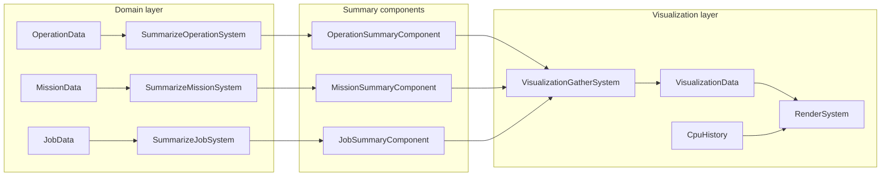

# Summarization and visualization refactor (v2)

## User feedback incorporated

1. **CpuHistory** includes game time and tick limit so UI rendering needs no game API calls except draw calls.
2. **Remove** list visualization code (ListVisualizer, ListVisualizerState, Ui list paths, RoomData::visualize) when no longer used.
3. **Per-entity summary components**: Each entity carries its own summary component; operations/missions/jobs update their own summaries. A single visualization dispatch system reads only these components and aggregates by room/global, decoupling the UI from ops/missions/jobs.

---

## Design principles (principal-engineer guidance)

- **No serialization of summary or visualization state**: Summary components and VisualizationData/CpuHistory are **not** in the serialization list (see [game_loop.rs](screeps-ibex/screeps-ibex/src/game_loop.rs) serialize_world and AGENTS.md). They are ephemeral: recreated or recomputed when visualization is on. This avoids segment bloat, format churn, and migration.
- **No panics in hot path**: Summarization and gather must handle missing data (e.g. `creep.room()` → `Option`, mission entity without RoomData). Use optional chaining; log and skip on unexpected missing data; do not unwrap in tick-critical code.
- **Explicit dispatcher dependencies**: Use `.with(System, "name", &["dependency"])` in the dispatcher builder so execution order is declared and reproducible.
- **Single responsibility**: Summarization systems only write one summary component type. VisualizationGatherSystem only reads summary components + RoomData + SpawnQueue and writes VisualizationData. RenderSystem only reads VisualizationData + CpuHistory and issues draw calls.
- **Feature gating**: When `features.visualize.on` is false, summarization systems and VisualizationGatherSystem receive `Option<WriteStorage<...>>` / `Option<Write<VisualizationData>>` and no-op. CpuTrackingSystem and RenderSystem similarly no-op when their resources are missing. No need to remove summary components from entities when toggling off; they are not serialized and will be absent after VM reload.

---

## 1. CPU: include tick and limit in history

- **Extend CpuHistory** to store:
  - `samples: Vec<f32>` (unchanged; cap at e.g. 48)
  - `tick: u32` (game time when last sample was pushed)
  - `tick_limit: f32` (cpu limit when last sample was pushed)
- **CpuTrackingSystem** (runs once per tick when visualization is on): calls `game::cpu::get_used()`, `game::cpu::tick_limit()`, `game::time()`; pushes sample and sets `tick` and `tick_limit` on the resource. This is the **only** place that calls game CPU/time during the visualization path.
- **RenderSystem** uses only: `CpuHistory` (samples, tick, tick_limit) and **draw primitives** (via Visualizer). No `game::time()` or `game::cpu::tick_limit()` in RenderSystem.
- **Placement of CpuTrackingSystem**: Run it immediately before RenderSystem (after VisualizationGatherSystem) so the sample includes all game logic up to and including the gather step; the histogram then reflects CPU before drawing. Tick/limit stored in CpuHistory so the axis labels need no game calls.

---

## 2. Per-entity summary components

Each entity type that appears in the overlay has a **summary component** that its own domain (or a small summarization system in that domain) updates. The visualization layer only reads these components and does not depend on OperationData, MissionData, or JobData.


| Entity / scope     | Summary component                                                 | Written by                              |
| ------------------ | ----------------------------------------------------------------- | --------------------------------------- |
| Operation entity   | `OperationSummaryComponent { label, detail }`                     | Operation summarization (after run)     |
| Mission entity     | `MissionSummaryComponent { description }` or richer               | Mission summarization (after run)       |
| Creep (job) entity | `JobSummaryComponent { creep_name, description }`                 | Job summarization (after run)           |
| Room entity        | `RoomVisibilitySummaryComponent` (or keep deriving from RoomData) | Room/visibility system or summarization |


- **OperationSummaryComponent**: One per operation entity. Summarization system reads OperationData, writes this component. No need to explicitly remove when entity is deleted; components are not serialized so they disappear with the entity.
- **MissionSummaryComponent**: One per mission entity. Summarization system reads MissionData, writes this component.
- **JobSummaryComponent**: One per creep that has a job. Summarization system reads CreepOwner + JobData, writes this component (creep name + job type; optional detail). Creeps are short-lived; component is not serialized.

**Lifecycle and serialization**: Summary components are **not** added to the serialization list in game_loop.rs. They are ephemeral: when visualization is on, summarization systems insert/update them each tick; when visualization is off, those systems do not run and components are not updated. After a VM reload, only serialized state is restored, so summary components are naturally absent until summarization runs again. This keeps the persistence contract unchanged and avoids segment size growth.

**Spawn queue** is a resource (SpawnQueue), not entity-backed. Options: (a) SpawnQueueSummarySystem writes per-room spawn summary into a resource or into RoomVisualizationData in an aggregate, or (b) add a “spawn queue summary” component per room entity filled by spawn system. Simplest: keep one small “spawn summary” step that reads SpawnQueue and is used only by the visualization aggregator.

**Room visibility**: Either a `RoomVisibilitySummaryComponent` on each room entity (filled from RoomData dynamic visibility) or the aggregator continues to read RoomData.get_dynamic_visibility_data() and build RoomVisibilitySummary. The former keeps “no game/ECS logic in aggregator” strict; the latter is minimal change. Prefer component for consistency.

---

## 3. Visualization dispatch (single system, summary → aggregate)

- **One system**: **VisualizationGatherSystem** (name chosen to avoid confusion with the old GatherVisualizationSystem; this one only gathers from summary components into VisualizationData). Runs when visualization is on.
- **Reads only:**
  - Entities + OperationSummaryComponent → global ops list (iterate join, push to VisualizationData.operations)
  - Entities + RoomData (room list, get_missions()) + MissionSummaryComponent → per-room missions (for each room entity, get mission entities from room_data.get_missions(), then mission_entity → MissionSummaryComponent; skip if component missing)
  - Entities + CreepOwner + JobSummaryComponent → per-room jobs: for each creep with both components, call `creep.room()` (returns `Option<Room>`). If `None`, skip that job (do not panic). If `Some(room)`, use `room.name()` and push to VisualizationData.get_or_create_room(room_name).jobs
  - RoomData + RoomVisibilitySummaryComponent (or RoomData only) → per-room room_visibility
  - SpawnQueue → per-room spawn queue (existing iter_requests() pattern)
- **Writes:** VisualizationData. Clear at start of run (viz.clear()), then fill from components. Use get_or_create_room(room_name) when adding jobs so rooms that appear only via creeps still get an entry.
- **No** reads of OperationData, MissionData, or JobData. UI is decoupled from domain types.
- **Error handling**: Resolve mission room entity → RoomData for room name: if get_room or room_data.get(room_entity) fails, skip that mission. Do not unwrap; log at trace level if desired.

---

## 4. Who writes the summary components?

- **SummarizeOperationSystem**: After RunOperationSystem. Reads OperationData (and MissionData/RoomData only for building detail strings, e.g. Claim target rooms). Writes OperationSummaryComponent on operation entity.
- **SummarizeMissionSystem**: After RunMissionSystem. Reads MissionData. Writes MissionSummaryComponent on mission entity.
- **SummarizeJobSystem**: After RunJobSystem (or after movement). Reads CreepOwner, JobData. Writes JobSummaryComponent on creep entity. Creep name from `creep_owner.owner.resolve().map(|c| c.name())`; handle None (skip or use placeholder).
- **SummarizeRoomVisibilitySystem** (optional): Reads RoomData (dynamic visibility). Writes RoomVisibilitySummaryComponent on room entity.
- **SpawnQueue**: No component; VisualizationGatherSystem reads SpawnQueue resource and fills VisualizationData.rooms[room].spawn_queue.

**Feature gating**: Each summarization system takes `Option<WriteStorage<XSummaryComponent>>`. When visualization is off, the resource is not inserted (see game_loop feature block), so the system receives None and returns immediately without running. No need to remove components from entities when toggling off.

---

## 5. Render and apply

- **RenderSystem**: Reads VisualizationData (aggregate), CpuHistory (samples + tick + tick_limit). Builds panel content and draws to Visualizer. **No** game API calls except draw primitives (via Visualizer).
- **ApplyVisualsSystem**: Unchanged; flushes Visualizer to game.

---

## 6. Dispatcher order and dependencies

Use explicit dependency names in the dispatcher builder so order is reproducible and documented:

```text
PreRun (Op / Mission / Job) → barrier
Run (Op / Mission / Job) → MovementUpdateSystem ("movement", &["run_jobs"]) → barrier
VisibilityQueueSystem
SummarizeOperationSystem ("summarize_operations", &["run_operations"])
SummarizeMissionSystem ("summarize_missions", &["run_missions"])
SummarizeJobSystem ("summarize_jobs", &["run_jobs"])
SummarizeRoomVisibilitySystem (optional, &["visibility_queue"])
  → barrier
VisualizationGatherSystem ("visualization_gather", &["summarize_operations", "summarize_missions", "summarize_jobs"])
CpuTrackingSystem ("cpu_tracking", &["visualization_gather"])   // push sample + tick + limit
  → barrier
SpawnQueueSystem, TransferQueueUpdateSystem, OrderQueueSystem → barrier
RoomPlanSystem → barrier
RenderSystem ("render", &["visualization_gather", "cpu_tracking"])   // reads VisualizationData + CpuHistory only
ApplyVisualsSystem ("apply_visuals", &["render"])
StatsSystem → ...
```

- **CpuTrackingSystem** runs after VisualizationGatherSystem so the CPU sample includes gather work; tick and limit are stored in CpuHistory so RenderSystem never calls game API.
- **RenderSystem** depends on visualization_gather and cpu_tracking; it only reads VisualizationData and CpuHistory.
- **Spawn queue timing**: VisualizationGatherSystem reads the SpawnQueue resource. If it runs before SpawnQueueSystem (as above), the overlay shows the previous tick's spawn queue. To show the current tick's spawn queue, run VisualizationGatherSystem after SpawnQueueSystem and add `"spawn_queue"` to its dependencies; then move the gather system and CpuTrackingSystem to after that barrier.

---

## 7. Remove list visualization code

- **Delete or strip:** ListVisualizer, ListVisualizerState ([visualize.rs](screeps-ibex/src/visualize.rs)), and all uses.
- **Ui** ([ui.rs](screeps-ibex/src/ui.rs)): Remove GlobalUIState.operations (ListVisualizerState), RoomUIState.missions, .spawn_queue, .jobs (ListVisualizerState). Remove initialize_global / initialize_room that add_text for Operations, Missions, Jobs, Spawn Queue. Keep only **with_room(room, visualizer, callback)** that provides `&mut RoomVisualizer` (and with_global if needed for transfer/order). So Ui becomes a thin accessor to Visualizer per room/global.
- **RoomData::visualize** ([room/data.rs](screeps-ibex/screeps-ibex/src/room/data.rs)): Remove the method that takes ListVisualizerState and draws room/visibility as list text; or remove entirely if no callers. RoomDynamicVisibilityData::visualize and RoomStaticVisibilityData::visualize that use list_state can be removed.
- **Transfer/order**: They only need `&mut RoomVisualizer` per room. Keep UISystem as a thin wrapper: `with_room(room, visualizer, |v| callback(v))` so transfer/order keep their current signature `(ui: &mut UISystem, visualizer: &mut Visualizer)` and minimal code changes. Alternative: remove UISystem and have transfer/order take `Write<Visualizer>` and call `visualizer.get_room(room)` directly; prefer the thin-wrapper approach for this refactor to limit blast radius.

---

## 8. Data flow (high level)




---

## 9. File layout

- **Summary component types**: In visualization.rs or a new `summary_components.rs` (or under a `summary` module). No dependency from visualization to operations/missions/jobs internals beyond the summary component definitions.
- **Summarization systems**: In each domain (operations/, missions/, jobs/) or in a single `summarize.rs` that imports OperationData, MissionData, JobData and writes the corresponding summary component. Latter keeps “who summarizes what” in one place.
- **VisualizationGatherSystem**: In visualization.rs; reads only summary components + RoomData + SpawnQueue, writes VisualizationData.
- **CpuTrackingSystem** and **CpuHistory** (with tick, limit): In visualization.rs, next to RenderSystem. Do not add summary or visualization types to the serialization list in game_loop (no ConvertSaveload/SerializeMarker).

---

## 10. Implementation order and verification

**Phase 1 – CPU only (low risk)**  
Extend CpuHistory with tick and tick_limit. Add CpuTrackingSystem; have it set sample, tick, tick_limit when resources present. In RenderSystem remove game::time() and game::cpu::tick_limit(); use CpuHistory. Register CpuTrackingSystem before RenderSystem. **Verify:** build and deploy; overlay shows tick and CPU histogram with correct axis.

**Phase 2 – Operations summary and gather**  
Define OperationSummaryComponent. Implement SummarizeOperationSystem (move ops logic from GatherVisualizationSystem). Add VisualizationGatherSystem that fills VisualizationData.operations from OperationSummaryComponent and for this phase still fills rooms from existing sources (MissionData, JobData, etc.). Remove ops branch from GatherVisualizationSystem or replace Gather entirely. **Verify:** ops panel and rest of overlay still correct.

**Phase 3 – All summary components**  
Add MissionSummaryComponent, JobSummaryComponent, and their summarization systems; optionally RoomVisibilitySummaryComponent. VisualizationGatherSystem stops reading MissionData, JobData (and optionally RoomData for visibility); reads only summary components + RoomData (room list, get_missions) + SpawnQueue. Remove GatherVisualizationSystem. Register all systems with explicit dependencies. **Verify:** missions, jobs, visibility, spawn queue correct.

**Phase 4 – List UI removal**  
Remove ListVisualizer, ListVisualizerState and all uses (room/data.rs, ui.rs). Simplify Ui to with_room / with_global only. **Verify:** build; transfer/order still compile and receive Ui.

**Phase 5 – Dispatcher and gating**  
Set .with(System, "name", &["dep"]) for all new systems. Confirm when visualize is off all summarization and render paths no-op (Option resources). **Verify:** run with overlay off and on; no panics.

---

## 11. Risks and mitigations

- **Stale or missing summary**: If a summarization system fails to run (e.g. wrong order) or does not insert a component, the gather system will skip that entity; the overlay may show incomplete data. Mitigation: explicit dispatcher dependencies; run summarization immediately after the corresponding Run* system.
- **Creep.room() or resolve() returns None**: Gather and summarization must use optional chaining and skip (or use a fallback string); never unwrap in the tick path. Same for mission room entity resolution.
- **Segment size**: Summary components and VisualizationData are not serialized, so no impact on segment layout or migration. If in future any summary were serialized, that would be a breaking change and must follow AGENTS.md (user confirmation).
- **Performance**: One extra join per summarization system and one gather pass over entities. Keep summary structs small (strings only); avoid allocation in hot loops where possible.

